## 实验目的
1. 分别收集尽量多的英语和汉语文本
2. 计算这些文本中英语字母和汉字的熵，对比本章课件第18页上表中给出的结果
3. 逐步扩大文本规模，分析多次增加之后熵的变化情况
4. 计算文本中中英文词汇的熵，并绘制不同文本规模的熵变化曲线
## 实验原理
### 数据来源
新华网不仅提供丰富的中文新闻报道，还设有专门的英文版网站。这使得用户能够同时获取高质量的中英文数据，满足实验中对两种语言数据的需求。此外，新华网网页结构稳定，方便通过爬虫工具提取数据，满足实验对数据量和多样性的要求。所以我们选择新华网作为数据来源。

访问`news.cn/robots.txt`来查看爬虫协议，确保实验的合法性：
```plaintext
# robots.txt for http://www.xinhuanet.com/
User-Agent: *
Allow: /
```
这说明任何人都是允许爬取的。

新华网提供了搜索服务，利用开发者工具查看网页活动发现，搜索是通过向一个网址发送GET请求实现的，网页会返回一个JSON文件，其中包含新闻的列表，含有每个新闻的标题、分区、链接、时间等。请求网址如下：
```python
SEARCH_PATTERN = 'https://so.news.cn/getNews?lang={lang}&curPage={page}\&searchFields={only_title}&sortField={by_relativity}&keyword={keyword}'
```

爬取思路大致是：先以初始关键词搜索获得新闻加入双端队列，然后依次访问队列中弹出的新闻进行爬取，再随机取访问的新闻标题中的一个词作为关键字，继续搜索加入队列。每次访问新闻后，将链接加入`visited`集合，避免重复访问。当`visited`的大小满足数据量需求时，终止搜索。初始关键字我们选取 `1`和`a`，这样搜索结果的倾向性较小。
### BeautifulSoup页面解析
`BeautifulSoup` 是一个用于解析HTML和XML的Python库，常用于从网页中提取所需的结构化数据。

由于标题、时间、分区等信息已经在搜索结果JSON中给出，我们只需要解析新闻的正文内容即可。利用开发者工具查看网页结构发现，正文的段落都在`id=detail`的`div`下的`<p></p>`中，用`BeautifulSoup`可以提取：
```python
def get_news(self, soup: BeautifulSoup, news: News) -> News:
	detail = soup.find('div', id='detail')
	paragraphs = detail.find_all('p')
	news.content = '\n'.join([p.text.strip() for p in paragraphs])
	...
```
### 基于requests的单线程爬虫
`requests` 是一个用于简化HTTP请求的Python库。它封装了Python自带的 `urllib` 模块，提供了更加人性化的接口，极大地简化了发送GET、POST等HTTP请求的代码书写。根据之前提到的爬取思路，在`xinhua-crawler/crawler_requests.py`定义`NewsCrawler`爬虫类：
```python
class NewsCrawler:
    """NewsCrawler类用于抓取新闻数据。
    Attrs:
        to_visit (Queue[News]): 待访问的新闻队列。
        data (list[News]): 已抓取的新闻数据列表。
        visited_urls (set[str]): 已访问的新闻URL集合。
        language (str): 抓取新闻的语言。
        max_news (int): 最大抓取新闻数量。
        init_keyword (str): 初始搜索关键词。
    Methods:
        crawl(self): 开始抓取新闻数据。
        search(self, keyword: str): 根据关键词搜索新闻。
        parse_search(self, response: requests.Response) -> list[str]|None: 解析搜索结果，返回新闻列表。
        is_news(soup: BeautifulSoup) -> bool: 判断页面内容是否为新闻。
        get_news(self, soup: BeautifulSoup, news: News) -> News: 从页面内容中提取新闻详细信息。
        save_data(self, foldername: str): 将抓取的数据保存到指定文件夹。
        load_data(self, foldername: str): 从指定文件夹加载已保存的数据。
    """
```
### 基于scrapy框架的并发爬虫
`Scrapy` 是一个功能强大的、用于网络爬虫开发的开源框架。它设计用于快速、高效地爬取和提取结构化数据，支持多线程和异步I/O操作，非常适合大规模数据采集任务。

首先在`xinhua-crawler`下创建名为`news_crawler`的Scrapy爬虫项目。
```bash
scrapy startproject news_crawler
```
生成一个爬虫模板在`news_crawler/spiders/news_spider.py`：
```bash
scrapy genspider example news.cn
```
按照上述爬取思路，修改模板：
```python
class NewsSpider(scrapy.Spider):
    """
    NewsSpider 是一个 Scrapy 爬虫类，用于从 news.cn 和 so.news.cn 网站上抓取新闻数据。
    属性:
        name (str): 爬虫名称。
        allowed_domains (list): 允许爬取的域名列表。
        visited_urls (set): 已访问的 URL 集合。
        news_queue (list): 新闻队列。
        ...
    方法:
        start_requests(self): 开始爬取请求，使用初始关键词。
        search(self, page, keyword): 根据关键词和页码生成搜索请求。
        parse_search(self, response): 解析搜索结果页面，提取新闻信息并加入队列。
        process_news_queue(self): 处理新闻队列中的新闻，生成新闻详情请求。
        is_news(soup): 静态方法，判断页面是否为新闻页面。
		...
    """
```
在`items.py`定义要爬取的数据结构`NewsItem`；然后在`pipeline.py`中定义数据处理流，进行数据清洗，将清洗后的数据储存。
### 数据清洗
要计算信息熵，需要分别只保留本语言的字符，去除一切外文字符、阿拉伯数字等等，这可以使用正则表达式完成；对于标点符号，需要统一其全半角格式；在新闻中，最后一个句号后的内容可能为编辑记者信息，需要去除；对于一个正常的文本，我们先验地认为其中的数字占比应该小于某一阈值，否则可能为数据表等非自然语言文本，我们应该去除；此外，我们留有一个参数选择是否去除标点符号，因为标点在需要分句分词的情况下可能有帮助。我们将这些数据清洗函数在`utils.cleaning`中实现。
### 信息熵
信息熵（Entropy）是信息论中的一个基本概念，用于衡量随机变量不确定性的大小。在文本处理中，信息熵通常被用于量化语言中的字符、词汇或其它符号分布的随机性和复杂性。

对于一个离散的随机变量 $X$，其可能的取值为 $x_1, x_2, ..., x_n$，每个取值的概率为 $P(x_i)$，则 $X$ 的信息熵 $H(X)$ 定义为：$$ H(X) = -\sum_{i=1}^{n} P(x_i) \log_2 P(x_i) $$其中，$P(x_i)$ 表示随机变量 $X$ 取值为 $x_i$ 的概率。

对英语文本中的字母进行信息熵计算时，每个字母可以看作一个随机变量，其出现频率即为概率分布。汉字的熵计算与英文字母类似，只是将字母替换为汉字。 我们可以写出`cal_entropy`函数计算一个列表的熵：

```python
def cal_entropy(data: list[str], verbose: bool = True) -> float:
    print("Counting data...")
    counter = Counter(data)
    total = len(data)
    entropy = 0
    for count in tqdm(counter.values(), desc="Calculating Entropy", disable=not verbose):
        prob = count / total
        entropy -= prob * math.log2(prob)
    return entropy
```

词汇的熵考虑的是整词出现的概率分布而非单个字母或汉字。对于中英文文本中的词汇，词汇熵更能体现语言的复杂性。通过对文本进行分词处理，统计词汇出现的频率，并基于这些频率计算词汇的熵。

通过逐步增加数据量并计算信息熵，可以观察熵的收敛趋势：

```python
for size in tqdm(range(0, len(data), step), desc="Calculating Entropy Curve"):
	# 更新累积计数器并记录新的数据量
	new_data = data[size:size + step]
	counter.update(new_data)
	total += len(new_data)

	# 计算当前数据量的熵值
	entropy = cal_incremental_entropy(counter, total)
	entropy_list.append(entropy)
```

在实验中，我们会将计算得到的熵值与课件中第18页表格给出的以下参考值进行对比，以评估数据质量和实验结果的合理性。

|  熵  |  字   |   词   |
| :-: | :--: | :---: |
| 英文  | 4.03 | 10.00 |
| 中文  | 9.71 | 11.46 |
## 代码结构

## 实验流程
### 爬取数据
使用基于requests的爬虫进行数据爬取：
```python
from news_crawler.crawler_requests import NewsCrawler
crawler = NewsCrawler('en', 100)
crawler.crawl()
crawler.save_data('data/cn')
```
同样地，爬取英文数据。计算得，新华网平均一条中文新闻含有约500词，平均一条英文含有约250词。我们爬取50,000条中文新闻与100,000条英文新闻。由于单线程爬虫的网络IO速度远小于CPU处理数据的速度，网络IO为限制爬虫效率的主要瓶颈，如果使用基于requests的单线程爬虫，将会花费很多时间。而并发爬虫可以解决这个问题，我们考虑使用scrapy并发爬虫框架。

使用基于scrapy的爬虫进行数据爬取，首先在`setting.py`配置参数，然后在命令行运行：
```bash
cd xinhua-crawler
scrapy crawl news_spider -s OUTPUT_DIR="../data/cn" -a language="cn" -a start_keyword="1" -s CLOSESPIDER_ITEMCOUNT=50000
```
以爬取50,000条中文新闻，并储存在`data/cn`中。对于英文同理爬取100,000条新闻：
```bash
cd xinhua-crawler
scrapy crawl news_spider -s OUTPUT_DIR="../data/en" -a language="en" -a start_keyword="a" -s CLOSESPIDER_ITEMCOUNT=100000
```
### 中英文字的熵
将爬取的新闻中的标点符号与空格去除，分字母或单词为列表，字母全部转化为小写，连接起来计算得到：
```plaintext
Reading CN News: 100%|██████████| 45497/45497 [00:00<00:00, 2232875.62it/s]
Processing CN News: 100%|██████████| 5/5 [00:01<00:00,  4.09it/s]
中文数据总字数为：41403562
Counting data...
Calculating Entropy: 100%|██████████| 6386/6386 [00:00<00:00, 3713924.76it/s]
中文信息熵为：9.75360458234057

Reading EN News: 100%|██████████| 98222/98222 [00:00<00:00, 1895374.56it/s]
Processing EN News: 100%|██████████| 10/10 [00:05<00:00,  1.72it/s]
英文数据总字母数为：142729487
Counting data...
Calculating Entropy: 100%|██████████| 26/26 [00:00<00:00, 214247.36it/s]
英文信息熵为：4.182886843417005
```
中文汉字熵与参考值相差0.04，英文字母熵与参考值相差0.15，都比较接近。实验结果显示，中文汉字的熵比英文字母熵更大。这可以从两种语言的字符集规模和结构差异来解释。中文的常用汉字数量通常在3,500到10,000个之间，而英文只有26个字母。在中文中随机选择一个字符的不确定性显著高于英文，导致更高的信息熵。汉字本身承载的信息量也较大，单个汉字可以独立表达一个概念或词汇，而单个英文字母需要组合成单词才具有语义，这使得在字符级别上，汉字的信息载荷更高。此外，中文语言的紧凑性增加了每个字符所能传递的信息量，这也进一步提升了汉字的熵值。

每次增加3M数据量，画出计算结果随数据量的变化：

| 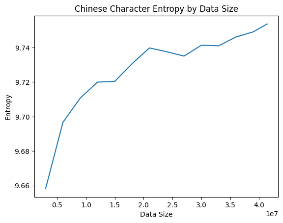 | 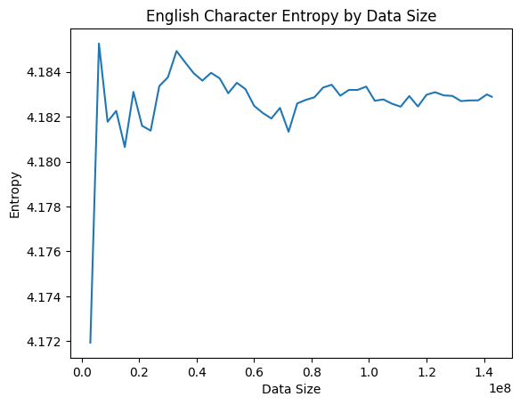 |
| :----------------------------------: | :----------------------------------: |
|             中文汉字熵随数据量变化              |             英文字母熵随数据量变化              |

随着数据量的上升，汉字熵和字母熵在数据量足够大到稳定后都呈现上升趋势。汉字熵在40M的数据增量内从9.66增长到9.75，增长幅度较大且稳定增长；字母熵在140M的数据增量内仅仅从4.455到4.460左右振荡增长，趋近于4.460。

随着数据量的增加，汉字熵的增长速度较快。我们**猜想**有两方面的原因：
1. 稀有字符的加入：由于汉字的字符集较大，在较小的数据集中，常用汉字的出现频率较高，随着数据量的增加，更多稀有汉字逐步进入统计范围，这导致了字符分布的多样性增加，提升了系统的不确定性，从而带来了信息熵的显著增长。
2. 高频字符的分布改变：汉字的高频字符集也较大，在较小的数据集中，高频字符集的分布也尚未趋于稳定。随着数据集增大，高频字符的分布改变，造成信息熵增长。

相比之下，英文字母的熵在数据量增加时振荡地趋于稳定。我们猜想这主要是因为英文字母集规模较小，只有26个字符，即使数据量增加，也不会引入新的“稀有”字符。同时，字母的频率分布较为稳定，字母“e”、“t”、“a”等高频字符在英文文本中的出现比例固定，因此字母熵很早就达到接近最大值，随后的数据增量对熵值的影响较小。
#### 验证稀有字符的影响
画出中英文字符集大小随数据集大小的变化曲线：

| 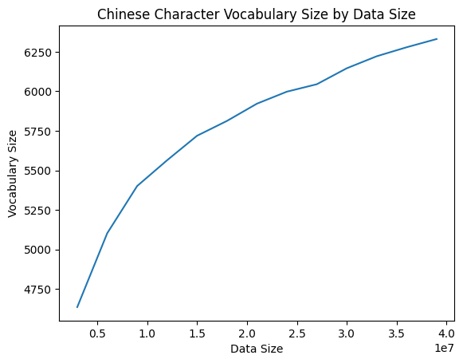 | 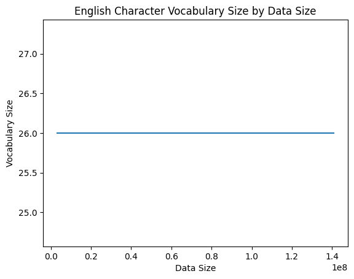 |
| :----------------------------------: | :----------------------------------: |
|             中文字符集随数据量变化              |             英文字符集随数据量变化              |

可以看到，英文字符集中的26个字母很早就全部出现，而且也不再加入新的字母；而中文字符集随着数据量增大稳步增长，在3M数据集上，字符集大小为4700左右，随后在40M数据集上增长到6400左右。

分别去除一定比例（从4000到6386，因为3M数据集上已经有4000字符集）的稀有字符，得到在不同大小字符集。在这些字符集上分别计算熵曲线，将熵减去基础值（3M数据量时的熵计算值），使得起点一致，方便对比。画出其随数据量的变化：

| 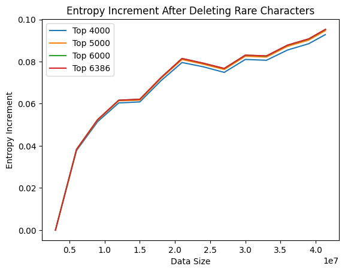 |
| :----------------------------------: |
|           去除稀有汉字后中文熵随数据量变化           |
Top6386 是中文未去除稀有字符的对照曲线。可以看出随着稀有字符的加入，熵增量增大，但影响很小，而Top4000的常用字符集仍然随着数据量的增大有显著的增长，说明稀有字符的加入并**不是**导致汉字熵随着数据量的增大而显著增长的主要因素。这可能是因为虽然数据量的增长引入了许多稀有字符，但这些稀有字符的出现概率十分低，对整体不确定性的作用很小。
#### 验证常用字符分布变化的影响
将字符按照使用频率从大到小排序，以最大数据集计算得的字符-频率（PDF）曲线为对照组，计算不同数据量下PDF曲线相对于对照组的变化比例曲线，作图：

| 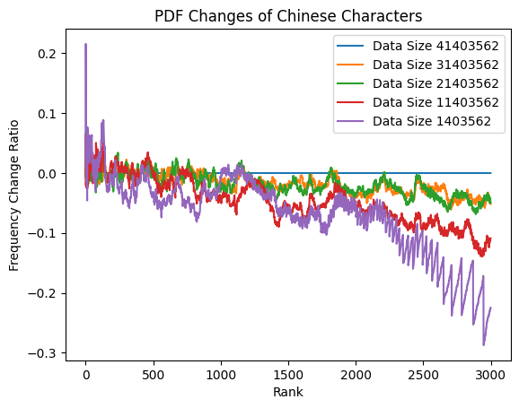 | 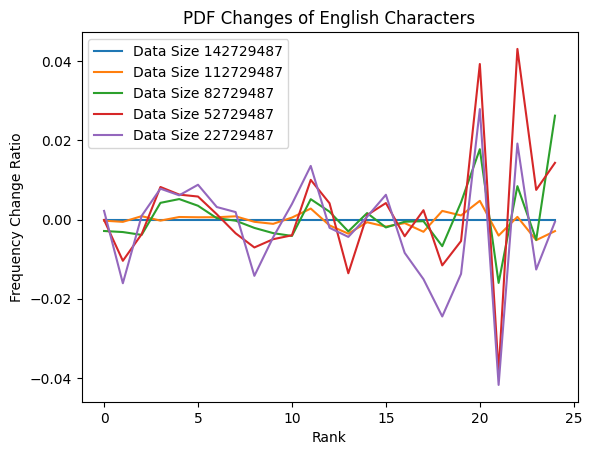 |
| :----------------------------------: | :----------------------------------: |
|           中文字符集不同数据量下PDF波动           |           英文字符集不同数据量下PDF波动           |

观察发现，即使英文数据量的变化更大，其PDF曲线波动对于常用字母基本在1%以内，对于非常用字母也在4%以内，总体分布平稳。而中文字符，即使只选取了最常用的3000词，其PDF曲线波动也是巨大的，对于最常用的一部分字符可以甚至达到20%，随着数据量的增大，相对常用字符的频率明显降低，而不那么常用的字符的频率明显上升。这种常用字符分布随数据量的显著变化，**是**导致汉字熵随着数据量的增大而显著增长的主要因素。
## 中英文词的熵
使用`jieba`进行汉语分词，使用`str.split`进行英语分词，英文单词全转化为小写。将爬取的新闻中分词为列表，去除其中的标点符号，连接起来计算得到：
```plaintext
中文数据总词数为：21370005
Counting data...
Calculating Entropy: 100%|██████████| 274886/274886 [00:00<00:00, 3811246.58it/s]
中文词信息熵为：12.617820727547258

英文数据总词数为：27103051
Counting data...
Calculating Entropy: 100%|██████████| 133444/133444 [00:00<00:00, 3535230.12it/s]
英文词信息熵为：10.676914172183697
```
计算得到词汇熵的与参考值的偏差，相比字母熵与参考值的偏差更大。这可能是因为爬取到的文本没有经过精细清洗，连续性比较差，导致不确定性更高，熵也就更高了。

每次增加0.5M数据量，画出词汇熵随数据量的变化：

| 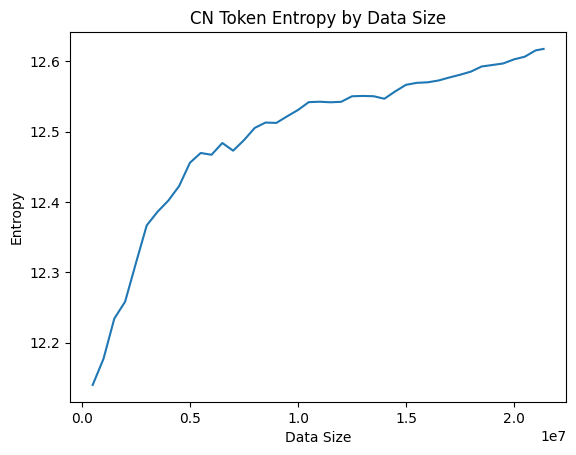 | 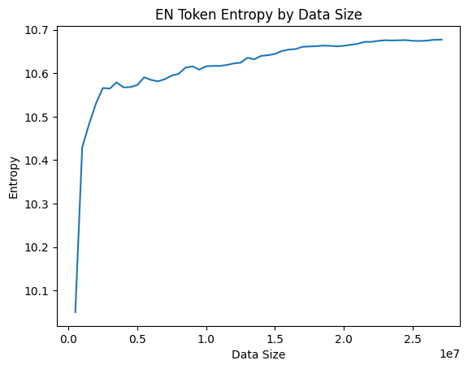 |
| :----------------------------------: | :----------------------------------: |
|             中文词汇熵随数据量变化              |             英文词汇熵随数据量变化              |

其总体表现和中文汉字熵曲线相似，画出词汇表大小曲线：

| 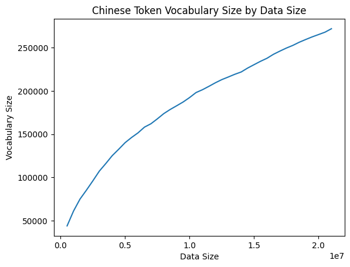 |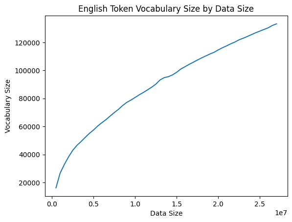
| :----------------------------------: | :----------------------------------: |
|             中文词汇量随数据量变化              |             英文词汇量随数据量变化              |

这也是和中文汉字字符集大小曲线十分相似的，他们的熵随着数据量增加的原因是相同的。
## 实验总结

本实验通过爬取大规模的中英文新闻文本，分析了不同语言在字符和词汇层面的信息熵变化，并探讨了稀有字符和常用字符分布变化对熵值的影响。实验结果为以下几个方面提供了量化分析和验证：

1. 中英文字符熵对比：通过计算中文汉字与英文字母的熵，我们发现中文汉字的熵值显著高于英文字母，这与字符集规模的差异密切相关。中文的常用汉字数量远超英文字母，因此随机选择一个汉字的不确定性较大，导致更高的信息熵。此外，汉字承载的信息量更高，单个汉字往往能表达完整的语义，而英文单个字母则需要通过组合成单词才能传递意义。这一结果与参考值相符，表明我们的实验方法和数据具有较高的可信度。
2. 熵随数据量的变化：随着数据量的增加，中文汉字的熵值增长速度较快。相比之下，英文字母的熵值增长较为平缓，并较早达到稳定。
3. 稀有字符的影响：我们通过去除不同比例的稀有字符并计算剩余字符集的熵，验证了稀有字符对信息熵的影响。结果表明，虽然稀有字符的加入确实提升了熵值，但这种影响较小。即使去除大量稀有字符，熵值随数据量的增加仍然显著增长。因此，稀有字符的加入并不是导致中文熵值快速增长的主要原因。
4. 常用字符分布的变化：实验进一步验证了常用字符分布变化对信息熵的影响。我们通过比较不同数据量下字符频率分布的波动情况，发现中文常用字符的分布在数据量增加时发生了显著变化。高频字符的相对出现频率逐渐降低，而低频字符的出现频率有所增加，这使得整个字符分布的多样性提升，从而导致信息熵的增长。这一现象在英文字母中并不显著，说明中文字符分布的变化是导致熵值增长的重要原因。
5. 中英文词汇熵的对比：在词汇层面的熵分析中，中文词汇的熵值也显著高于英文词汇。这是因为中文的词汇量庞大且词汇间的组合方式复杂，导致不确定性较高。此外，词汇熵略高于参考值，可能是由于数据源的连续性较差、文本清洗不足等原因，导致词汇分布的复杂性增加。